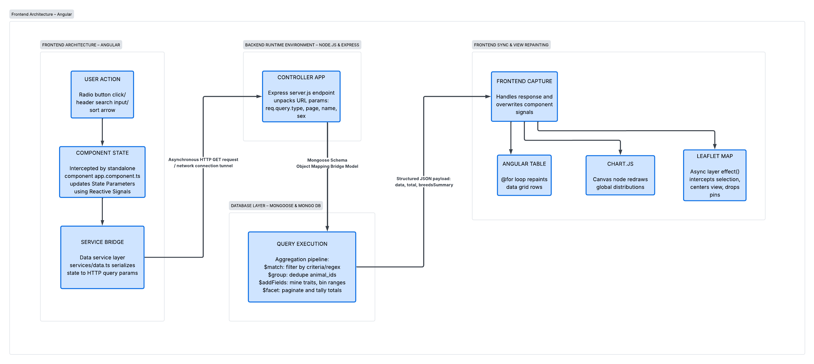

# Trevin Carlisle Professional ePortfolio
## Data Dashboard Enhancement Capstone Project
### Professional Self-Assessment

professional assessment goes here

---

### Code Review

<video width="100%" height="auto" controls>
  <source src="assets/code-review.mp4" type="video/mp4">
  Your browser does not support the video tag.
</video>

This video (runtime 32:53) walks through the .ipynb module that powers the original data dashboard that this project enhances, highlighting issues that need to be resolved in the enhancement.

---

### Original Artifact and Enhancement
#### Original Artifact: CS 340 Project Two - Python Data Dashboard

You can access the complete raw source code for the original Python script here:
> [Jupyter Notebook Artifact](assets/ProjectTwoDashboard.ipynb)
> 
> [Python CRUD Helper Module](CRUD_Python_Module.py)

#### Enhanced Artifact: CS 499 Capstone Enhancement - MEAN Stack Data Dashboard

You can access the complete raw source code for the enhanced MEAN Stack dashboard here:
> [Angular Frontend Client Code](./client)
>
> [Node.js and Express Backend Server Code](./server)

Database Query Diagram

The Python data dashboard was a final project from a previous course in my computer science program. It was rushed and needed some improvement, even if it were to stay in Python. However, I chose to update it to a full MEAN stack application to push myself and fully demonstrate my abilities as a programmer. This project was developed for the capstone of my computer science degree, so I wanted to make a very big change. I chose this artifact because I really enjoyed the idea of it and the initial development, but I knew I could've done better. I wanted to do justice to this project that I enjoyed so much. The big change for this enhancement is obviously that the entire platform the program is developed on has undergone a complete overhaul. Beyond this large change, I implemented a few other things to make the artifact more efficient and optimized. Defining a schema for the Animal JSON object and defining compound indexes directly in MongoDB streamlines the processes of importing and filtering data to stream to the UI. Additionally, I wrote an in-database feature-mining analytics route. This framework allows the optimized C++ engine in MongoDB to deliver data structures to the Angular frontend elements. As I was creating the enhanced artifact, I learned a few new things and strengthened my skills in other areas. I learned how to create visual data dashboard elements that update live, and how to split and paginate data to speed up loading times for a website. I also strengthened my skills in data analytics, visual communication, web development, and database management. A big challenge I faced in creating and updating this dashboard was the location data. When pulling data from the Austin Animal Shelter's public records, there was no location data for any of the animals in their records. Despite this, the original project's data dashboard had location data and a Leaflet map showing every animal's location. I reached out to the instructor for the course this artifact came from originally, asking where this location data came from, only to receive no response. In lieu of any sort of reply from my previous professor, I opted to, as a temporary placeholder, generate randomized locations for each animal. If my instructor responds at any point, I will update the project with proper data, but for now, each animal is randomly placed at some point within roughly 20 miles of the Austin Animal Shelter. This is mainly to bypass that small hurdle so I could demonstrate my ability to functionally implement a Leaflet map. 
